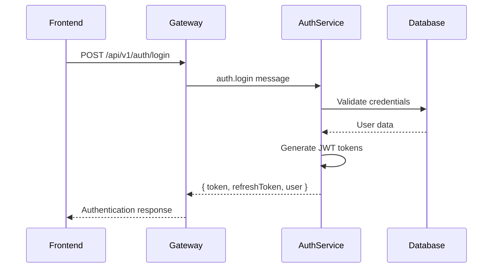
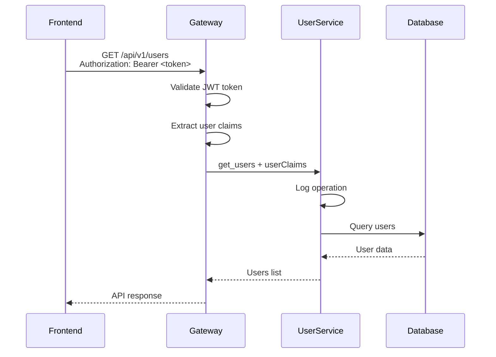

# JWT Authentication Flow Architecture

This document describes the JWT-based authentication flow implemented in the PITCH API gateway and microservices architecture.

## Overview

The authentication system follows this flow:

1. **Auth Service** → Issues JWT tokens during login/registration
2. **API Gateway** → Validates JWT tokens and extracts user claims
3. **Gateway Controllers** → Forward user claims to microservices
4. **Microservices** → Receive and use user claims for authorization

## Architecture Components

### 1. Authentication Service (`/api/v1/auth/*`)

**Location**: `src/microservices/auth/`

**Responsibilities**:

- User registration and login
- JWT token generation and validation
- Refresh token management
- Password hashing and verification

**Key Endpoints**:

```
POST /api/v1/auth/register - User registration
POST /api/v1/auth/login    - User authentication
POST /api/v1/auth/refresh  - Token refresh
POST /api/v1/auth/logout   - User logout
GET  /api/v1/auth/me       - Get user profile
```

### 2. API Gateway Authentication Layer

**Location**: `src/gateway/`

**Components**:

#### Global JWT Auth Guard (`guards/global-jwt-auth.guard.ts`)

- Validates JWT tokens on all non-public routes
- Extracts user claims from valid tokens
- Adds user information to request context
- Forwards user claims in headers for downstream services

#### User Claims Interceptor (`interceptors/user-claims.interceptor.ts`)

- Ensures user claims are properly attached to requests
- Provides logging for authentication events

#### User Claims Decorator (`decorators/user-claims.decorator.ts`)

- Simplifies access to authenticated user information in controllers

### 3. Protected Gateway Controllers

All gateway controllers now require authentication:

- `UserGatewayController` - Protected user operations
- `BusinessGatewayController` - Protected business operations
- `AuthGatewayController` - Mixed public/protected auth operations

### 4. Microservices with User Context

**Location**: `src/microservices/user/` and `src/microservices/business/`

**Features**:

- Receive user claims with every request
- Log which user performed each operation
- Can implement user-specific authorization logic

## Authentication Flow Details

### 1. User Registration/Login



### 2. Protected API Request



## User Claims Structure

User claims are automatically extracted from valid JWT tokens and forwarded to microservices:

```typescript
interface UserClaims {
  id: string; // User ID
  email: string; // User email
  name: string; // User display name
}
```

## Implementation Examples

### Frontend Usage

```typescript
// Login request
const loginResponse = await fetch('/api/v1/auth/login', {
  method: 'POST',
  headers: { 'Content-Type': 'application/json' },
  body: JSON.stringify({ email, password }),
});

const { token, user } = await loginResponse.json();

// Protected request
const usersResponse = await fetch('/api/v1/users', {
  headers: {
    Authorization: `Bearer ${token}`,
    'Content-Type': 'application/json',
  },
});
```

### Gateway Controller

```typescript
@Controller({ path: 'users', version: '1' })
@UseGuards(GlobalJwtAuthGuard)
@UseInterceptors(UserClaimsInterceptor)
export class UserGatewayController {
  @Get()
  async getUsers(@UserClaims() userClaims: any) {
    return this.userService.send('get_users', {
      userClaims, // Automatically forwarded
    });
  }
}
```

### Microservice Controller

```typescript
@MessagePattern('get_users')
async getUsers(@Payload() data: MessageWithUserClaims) {
  this.logger.log(`Getting users - Requested by: ${data.userClaims.email}`);

  // Can implement user-specific logic here
  // e.g., filter results based on user permissions

  return await this.userService.findAll();
}
```

## Security Features

### JWT Token Validation

- Automatic token validation on all protected routes
- Configurable token expiration times
- Refresh token rotation for enhanced security

### User Context Logging

- All microservice operations log the requesting user
- Audit trail for security and debugging
- Request traceability across services

### Route Protection

- Public routes marked with `@Public()` decorator
- All other routes require valid JWT tokens
- Flexible per-route authentication control

## Error Handling

### Authentication Errors

- **401 Unauthorized**: Invalid or missing token
- **403 Forbidden**: Valid token but insufficient permissions
- **Token Expired**: Automatic refresh token flow

### Error Responses

```typescript
{
  "statusCode": 401,
  "message": "Access token has expired",
  "error": "Unauthorized"
}
```

## Configuration

### Environment Variables

```env
# JWT Configuration
JWT_SECRET="your-secret-key"
JWT_EXPIRES_IN="15m"
JWT_REFRESH_SECRET="your-refresh-secret"
JWT_REFRESH_EXPIRES_IN="7d"

# Database
AUTH_DATABASE_URL="postgresql://..."
```

### Gateway Module Setup

```typescript
@Module({
  imports: [
    JwtModule.register({
      secret: process.env.JWT_SECRET,
      signOptions: { expiresIn: process.env.JWT_EXPIRES_IN },
    }),
    // ... other imports
  ],
  providers: [GlobalJwtAuthGuard, UserClaimsInterceptor],
})
export class GatewayModule {}
```

## Benefits

1. **Centralized Authentication**: JWT validation happens once at the gateway
2. **User Context**: All microservices know which user made the request
3. **Audit Trail**: Complete logging of user operations
4. **Security**: No token forwarding to microservices
5. **Scalability**: Stateless JWT tokens work across multiple instances
6. **Flexibility**: Easy to add user-specific authorization logic

## Testing

### Manual Testing

```bash
# 1. Register a user
curl -X POST http://localhost:8001/api/v1/auth/register \
  -H "Content-Type: application/json" \
  -d '{"email":"test@example.com","password":"password123","name":"Test User"}'

# 2. Login and get token
curl -X POST http://localhost:8001/api/v1/auth/login \
  -H "Content-Type: application/json" \
  -d '{"email":"test@example.com","password":"password123"}'

# 3. Use token for protected requests
curl -X GET http://localhost:8001/api/v1/users \
  -H "Authorization: Bearer YOUR_TOKEN_HERE"
```

### Expected Behavior

1. All protected endpoints require valid JWT tokens
2. Microservices log the requesting user for each operation
3. Invalid/expired tokens return 401 Unauthorized
4. User claims are automatically forwarded to microservices

## Next Steps

1. **Set up environment variables** for JWT configuration
2. **Test the authentication flow** with the provided examples
3. **Implement user-specific authorization** in microservices as needed
4. **Add rate limiting** and other security measures
5. **Monitor authentication logs** for security auditing
