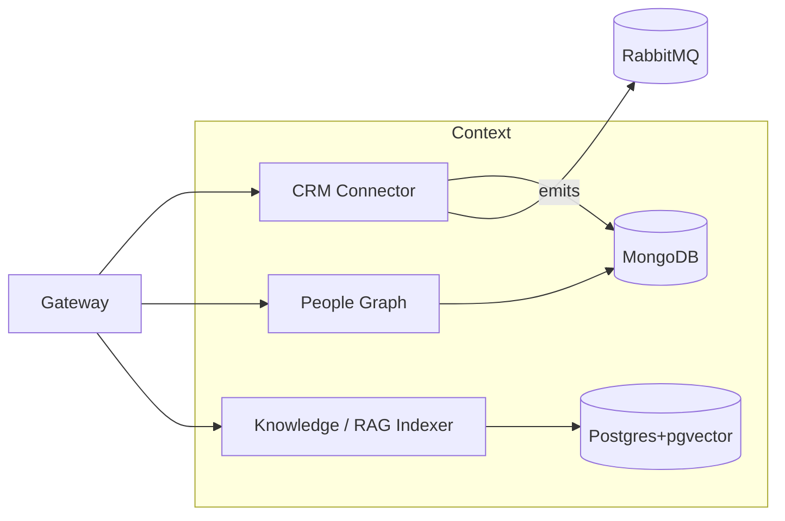

CRM Connector (Salesforce first)

Purpose: OAuth, fetch accounts/contacts/opps into MongoDB; refresh jobs.

HTTP

POST /crm/salesforce/oauth/callback

POST /crm/sync (start sync), GET /crm/status

GET /crm/contacts, GET /crm/accounts

Events (emit): crm.sync.completed, crm.contact.updated

Data in: OAuth tokens, sync window

Data out: normalized contacts/accounts, sync status

Storage: MongoDB (external business records)

People Graph

Purpose: “Client Persons”, personas (buyer roles, pain points), relationships.

HTTP

POST /clients, GET /clients/:id, GET /clients?query

POST /personas, GET /personas

Events (emit): client.created, persona.updated

Data in: client/persona profiles, tags, CRM refs

Data out: persona bundles for scenarios/sim

Storage: MongoDB

Knowledge / RAG Indexer

Purpose: index documents (decks/FAQs/transcripts) for retrieval; serve RAG
queries to AI.

HTTP

POST /index (upload text/urls), GET /index/:id

POST /search (semantic), POST /retrieve (RAG chunks)

Events (emit): doc.indexed

Data in: raw text, metadata (org, product, confidentiality)

Data out: top-K chunks with citations

Storage: Postgres + pgvector (embeddings), MongoDB (raw docs if needed)
