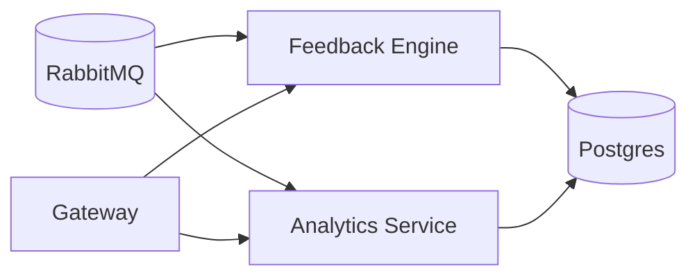

Feedback Engine

Purpose: rubric scoring (clarity, empathy, objection handling, keyword
coverage); coach tips.

HTTP / gRPC

POST /feedback/score (sessionId or transcript)

GET /feedback/:sessionId

Events (consume): simulation.completed

Events (emit): feedback.ready

Data in: transcript (text/timecodes), rubric id, language

Data out: scorecard (per-dimension), suggestions, keyword coverage

Storage: Postgres (scorecards, rubric versions)

Analytics Service

Purpose: KPIs for reps & teams; dashboard aggregates; time-series.

HTTP

GET /stats/user/:id, GET /stats/team/:orgId

GET /leaderboard?orgId, GET /trends?metric

Events (consume): simulation._, feedback.ready, crm._, recording.available

Data in: scorecards, session durations, #objections handled, win/loss sim
outcome

Data out: aggregates for dashboard, CSV export

Storage: Postgres (start) or add ClickHouse later for heavy timeseries
