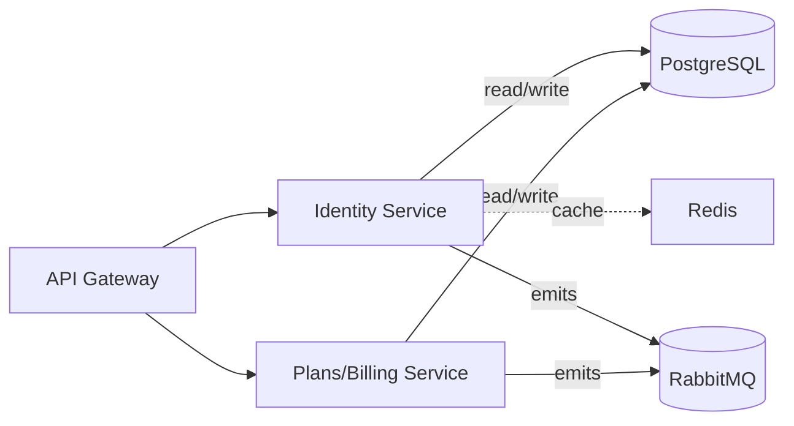

1. Identity & Plans (Accounts, Settings, User-plans)

Identity Service

Purpose: users, orgs, roles, account settings; issues JWT (access/refresh).

HTTP (JWT protected)

POST /auth/login (NextAuth callback), POST /auth/refresh

GET /me, PATCH /me/settings

POST /orgs, GET /orgs/:id, PATCH /orgs/:id

POST /users (invite), PATCH /users/:id/role

Events (emit): user.created, org.created, role.changed, settings.updated

Data in: OAuth profile (NextAuth), org metadata, role requests

Data out: JWT (access/refresh), user/org/role objects

Storage: Postgres (users, orgs, roles, settings), Redis (sessions/blacklist)

Plans/Billing Service

Purpose: plan catalog, subscriptions, quotas/usage (even if payment is manual in
capstone).

HTTP

GET /plans, POST /subscriptions, GET /usage?user|org

PATCH /subscriptions/:id (upgrade/downgrade), GET /quotas

Events (emit): plan.changed, quota.updated

Data in: org id, desired plan, usage counters

Data out: subscription record, quota limits

Storage: Postgres (plans, subscriptions, usage tallies)
