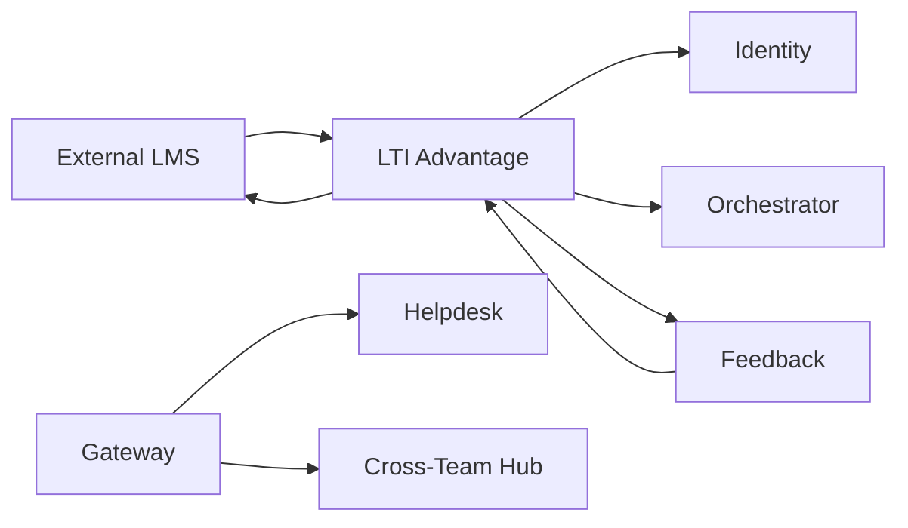

LTI Advantage

Purpose: LMS launch, roster, deep-linking, AGS grade passback.

HTTP

POST /lti/launch (OIDC), POST /lti/ags/score

GET /lti/nrps/roster, POST /lti/deeplink

Data in: id_token (JWT), course/context ids

Data out: mapped user/org, grade passback payloads

Storage: Postgres (LTI registrations, keys, mappings)

Helpdesk

Purpose: “Contact external help” → tickets/triage; email/Slack/webhook.

HTTP

POST /support/tickets, GET /support/tickets/:id

Events (emit): support.ticket.created

Storage: Postgres (tickets)

Cross-Team Hub

Purpose: threads/Q&A, share scorecards and best answers across teams.

HTTP

POST /threads, GET /threads?orgId, POST /threads/:id/reply

Events (emit): thread.created, solution.accepted

Storage: MongoDB (threads/messages)
