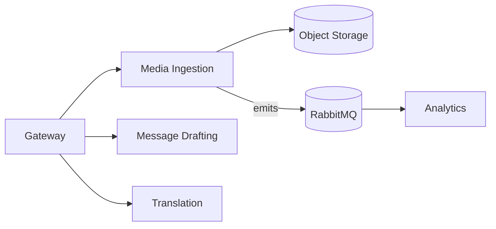

Media Ingestion

Purpose: upload real calls, normalize audio, diarization → STT → reference
library.

HTTP

POST /uploads (pre-signed url), POST /ingest (finalize)

GET /media/:id, GET /media/:id/transcript

Events (emit): media.ingested, stt.completed

Data in: audio/video blob, metadata (lang, customer, tags)

Data out: transcript, segmentation, embeddings (optional into RAG)

Storage: object storage (files), MongoDB (indexes/segments)

Message Drafting

Purpose: generate/edit emails/messages from scenario/transcript.

HTTP

POST /drafts/email (inputs: transcript, tone, CTA)

POST /drafts/message (Slack/SMS style)

Data in: context, tone, recipient profile

Data out: suggested draft(s)

Storage: MongoDB (optional history)

Translation

Purpose: multi-language support (UI handled in web; service translates content).

HTTP

POST /translate (text/batch), POST /localize/scorecard

Data in: text, source/target locales

Data out: translated text (and adjusted rubric labels)

Storage: stateless (cache translations in Redis if needed)
