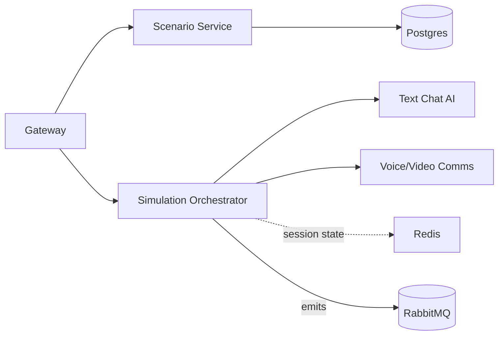

Scenario Service

Purpose: templates, difficulty, goals; auto-generate using CRM/Personas/RAG.

HTTP

POST /scenarios (create), GET /scenarios, GET /scenarios/:id

POST /scenarios/generate (inputs: industry, persona, product, goal)

Data in: persona, CRM context, objectives

Data out: scenario (script, persona traits, evaluation rubric id)

Storage: Postgres (templates, versions)

Simulation Orchestrator

Purpose: session lifecycle + multi-turn state machine (LangGraph), tool calls to
AI/Voice.

HTTP / gRPC

POST /sessions (start), POST /sessions/:id/turn (user msg)

POST /sessions/:id/end, GET /sessions/:id

Events (emit): simulation.started, turn.completed, simulation.completed

Data in: scenario, user input, RAG results

Data out: assistant turns, transcript pointer, session summary

Storage: Redis (active session), MongoDB (full transcript), optional S3 for
media

Text Chat AI

Purpose: call GPT-4o (fallback: local Llama) with tools: retrieve, crm.lookup,
score.stub.

gRPC/REST

GenerateTurn(context, userMsg) -> assistantMsg

Tool: retrieve(query), crm.lookup(contactId)

Data in: session context, retrieved chunks, persona

Data out: assistant message (text + tool traces)

Storage: stateless (logs → MongoDB optional)

Voice/Video Comms

Purpose: WebRTC, STT (Whisper), TTS (Azure/ElevenLabs), recording.

HTTP

POST /webrtc/offer, POST /recordings (save), GET /recordings/:id

Events (emit): recording.available

Data in: media streams, session id

Data out: transcript segments, recording URLs

Storage: MongoDB (metadata), object storage (recordings), STT text back to
MongoDB
