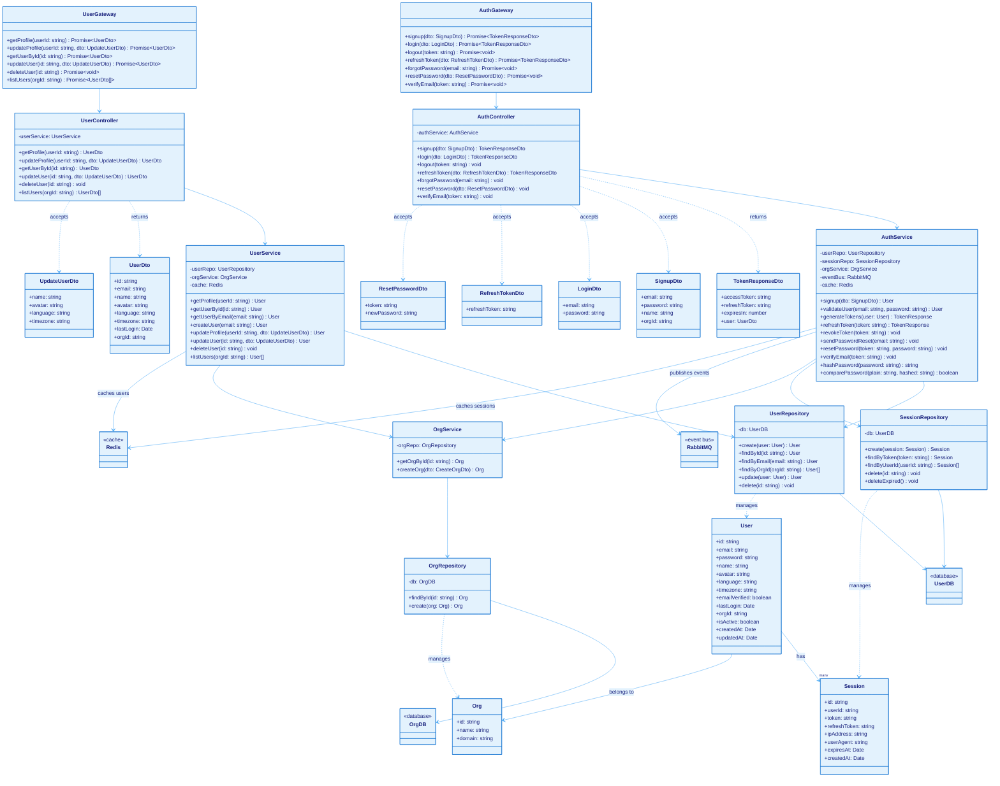

```mermaid
%%{init: {'theme':'base', 'themeVariables': { 'primaryColor':'#e3f2fd','primaryTextColor':'#1a237e','primaryBorderColor':'#1976d2','lineColor':'#42a5f5','secondaryColor':'#fff3e0','secondaryTextColor':'#e65100','secondaryBorderColor':'#fb8c00','tertiaryColor':'#f3e5f5','tertiaryTextColor':'#4a148c','tertiaryBorderColor':'#7b1fa2','noteBkgColor':'#fff9c4','noteTextColor':'#f57f17'}}}%% 
classDiagram
    class AuthGateway {
        +signup(dto: SignupDto) Promise~TokenResponseDto~
        +login(dto: LoginDto) Promise~TokenResponseDto~
        +logout(token: string) Promise~void~
        +refreshToken(dto: RefreshTokenDto) Promise~TokenResponseDto~
        +forgotPassword(email: string) Promise~void~
        +resetPassword(dto: ResetPasswordDto) Promise~void~
        +verifyEmail(token: string) Promise~void~
    }

    class UserGateway {
        +getProfile(userId: string) Promise~UserDto~
        +updateProfile(userId: string, dto: UpdateUserDto) Promise~UserDto~
        +getUserById(id: string) Promise~UserDto~
        +updateUser(id: string, dto: UpdateUserDto) Promise~UserDto~
        +deleteUser(id: string) Promise~void~
        +listUsers(orgId: string) Promise~UserDto[]~
    }

    class AuthController {
        -authService: AuthService
        +signup(dto: SignupDto) TokenResponseDto
        +login(dto: LoginDto) TokenResponseDto
        +logout(token: string) void
        +refreshToken(dto: RefreshTokenDto) TokenResponseDto
        +forgotPassword(email: string) void
        +resetPassword(dto: ResetPasswordDto) void
        +verifyEmail(token: string) void
    }

    class UserController {
        -userService: UserService
        +getProfile(userId: string) UserDto
        +updateProfile(userId: string, dto: UpdateUserDto) UserDto
        +getUserById(id: string) UserDto
        +updateUser(id: string, dto: UpdateUserDto) UserDto
        +deleteUser(id: string) void
        +listUsers(orgId: string) UserDto[]
    }

    class AuthService {
        -userRepo: UserRepository
        -sessionRepo: SessionRepository
        -orgService: OrgService
        -eventBus: RabbitMQ
        -cache: Redis
        +signup(dto: SignupDto) User
        +validateUser(email: string, password: string) User
        +generateTokens(user: User) TokenResponse
        +refreshToken(token: string) TokenResponse
        +revokeToken(token: string) void
        +sendPasswordReset(email: string) void
        +resetPassword(token: string, password: string) void
        +verifyEmail(token: string) void
        +hashPassword(password: string) string
        +comparePassword(plain: string, hashed: string) boolean
    }

    class UserService {
        -userRepo: UserRepository
        -orgService: OrgService
        -cache: Redis
        +getProfile(userId: string) User
        +getUserById(id: string) User
        +getUserByEmail(email: string) User
        +createUser(email: string) User
        +updateProfile(userId: string, dto: UpdateUserDto) User
        +updateUser(id: string, dto: UpdateUserDto) User
        +deleteUser(id: string) void
        +listUsers(orgId: string) User[]
    }

    class OrgService {
        -orgRepo: OrgRepository
        +getOrgById(id: string) Org
        +createOrg(dto: CreateOrgDto) Org
    }

    class UserRepository {
        -db: UserDB
        +create(user: User) User
        +findById(id: string) User
        +findByEmail(email: string) User
        +findByOrgId(orgId: string) User[]
        +update(user: User) User
        +delete(id: string) void
    }

    class SessionRepository {
        -db: UserDB
        +create(session: Session) Session
        +findByToken(token: string) Session
        +findByUserId(userId: string) Session[]
        +delete(id: string) void
        +deleteExpired() void
    }

    class OrgRepository {
        -db: OrgDB
        +findById(id: string) Org
        +create(org: Org) Org
    }

    class User {
        +id: string
        +email: string
        +password: string
        +name: string
        +avatar: string
        +language: string
        +timezone: string
        +emailVerified: boolean
        +lastLogin: Date
        +orgId: string
        +isActive: boolean
        +createdAt: Date
        +updatedAt: Date
    }

    class Session {
        +id: string
        +userId: string
        +token: string
        +refreshToken: string
        +ipAddress: string
        +userAgent: string
        +expiresAt: Date
        +createdAt: Date
    }

    class Org {
        +id: string
        +name: string
        +domain: string
    }

    class UserDB {
        <<database>>
    }

    class OrgDB {
        <<database>>
    }

    class Redis {
        <<cache>>
    }

    class RabbitMQ {
        <<event bus>>
    }

    class UserDto {
        +id: string
        +email: string
        +name: string
        +avatar: string
        +language: string
        +timezone: string
        +lastLogin: Date
        +orgId: string
    }

    class TokenResponseDto {
        +accessToken: string
        +refreshToken: string
        +expiresIn: number
        +user: UserDto
    }

    class SignupDto {
        +email: string
        +password: string
        +name: string
        +orgId: string
    }

    class LoginDto {
        +email: string
        +password: string
    }

    class RefreshTokenDto {
        +refreshToken: string
    }

    class UpdateUserDto {
        +name: string
        +avatar: string
        +language: string
        +timezone: string
    }

    class ResetPasswordDto {
        +token: string
        +newPassword: string
    }

    AuthGateway --> AuthController
    UserGateway --> UserController
    AuthController --> AuthService
    UserController --> UserService
    AuthService --> UserRepository
    AuthService --> SessionRepository
    AuthService --> OrgService
    AuthService --> RabbitMQ : publishes events
    AuthService --> Redis : caches sessions
    UserService --> UserRepository
    UserService --> OrgService
    UserService --> Redis : caches users
    OrgService --> OrgRepository
    UserRepository --> UserDB
    SessionRepository --> UserDB
    OrgRepository --> OrgDB
    UserRepository ..> User : manages
    SessionRepository ..> Session : manages
    OrgRepository ..> Org : manages
    AuthController ..> TokenResponseDto : returns
    AuthController ..> SignupDto : accepts
    AuthController ..> LoginDto : accepts
    AuthController ..> RefreshTokenDto : accepts
    AuthController ..> ResetPasswordDto : accepts
    UserController ..> UserDto : returns
    UserController ..> UpdateUserDto : accepts
    User "1" --> "many" Session : has
    User --> Org : belongs to

```