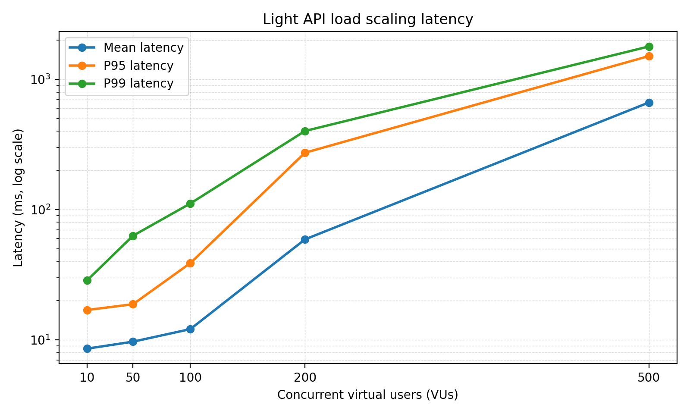
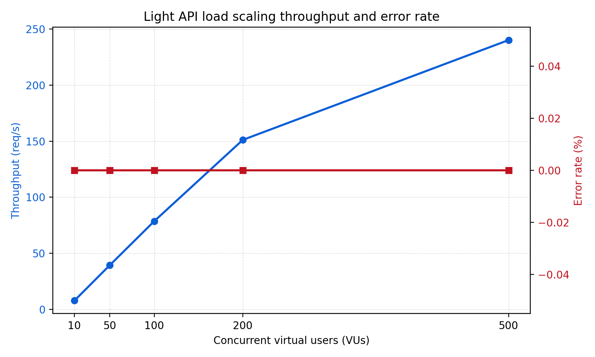
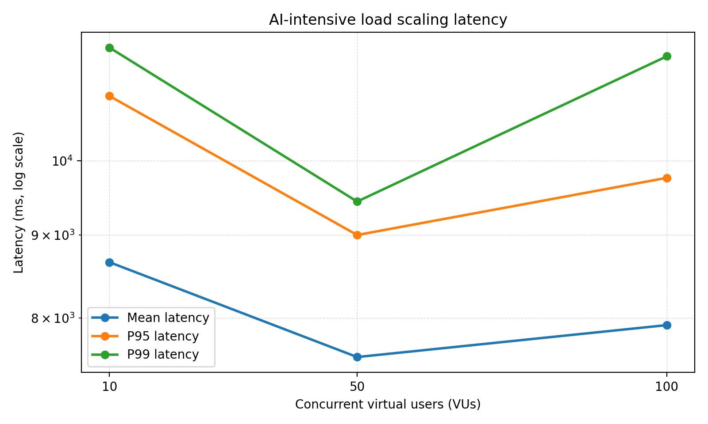
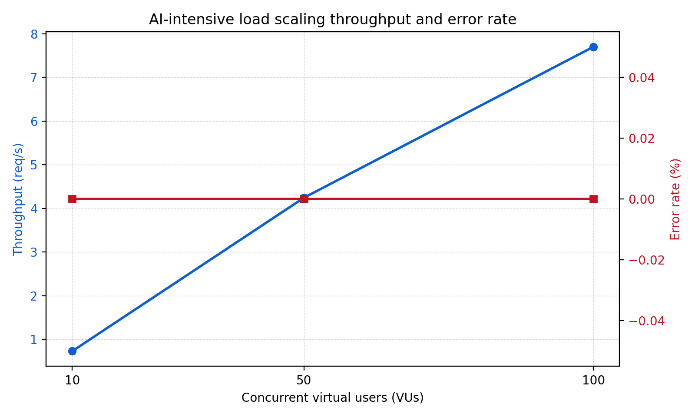
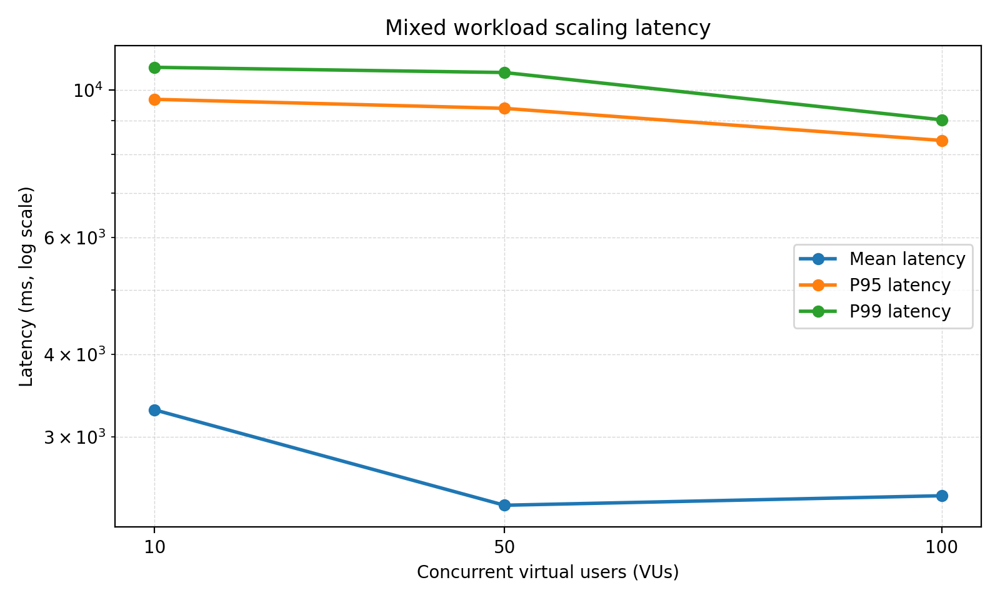
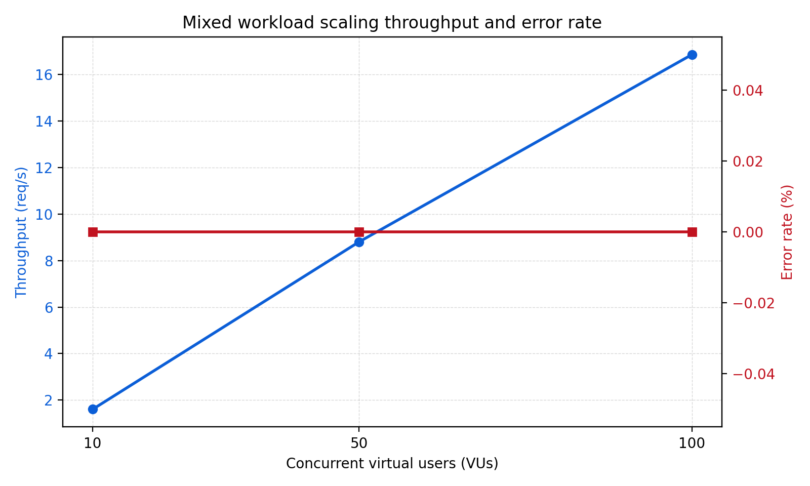
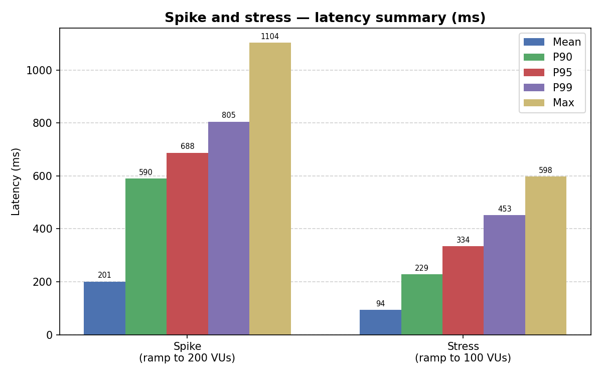
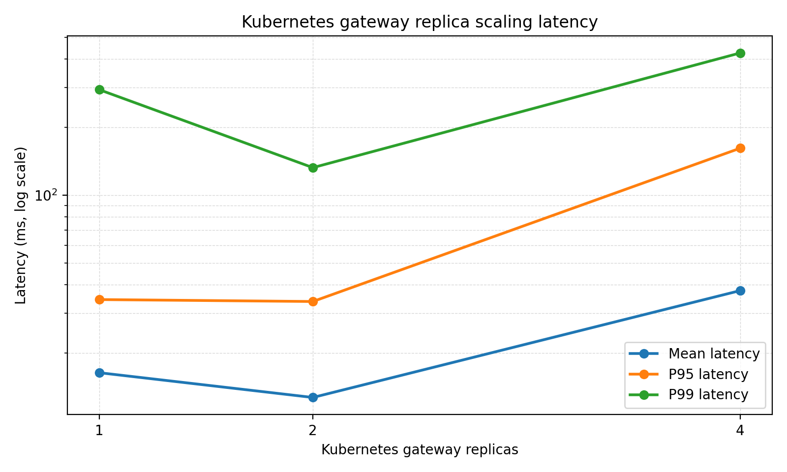
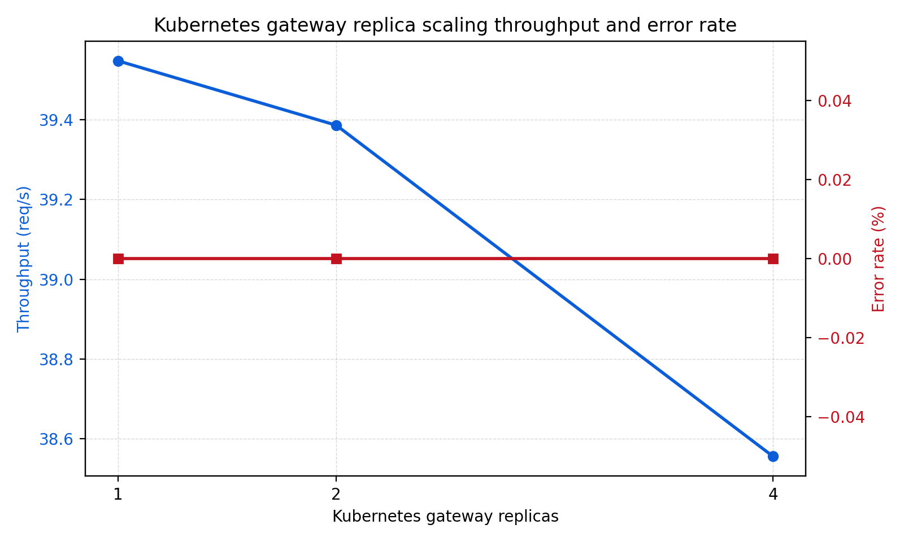

# Performance Evaluation of P.I.T.C.H. in a Kubernetes Deployment

## Preamble

Public repository: https://github.com/MmagdyHafezZ/PITCH

Measurement data and reproducibility artifacts are stored in the public
repository:

- Raw k6 summaries:
  [perf/results/production-k8s/](https://github.com/MmagdyHafezZ/PITCH/tree/main/perf/results/production-k8s)
- Report dataset config:
  [perf/report_datasets/final-production-k8s.json](https://github.com/MmagdyHafezZ/PITCH/blob/main/perf/report_datasets/final-production-k8s.json)
- Generated plots:
  [output/doc/assets/final-production-k8s/](https://github.com/MmagdyHafezZ/PITCH/tree/main/output/doc/assets/final-production-k8s)
- Kubernetes runbook:
  [docs/production-k8s-final-evaluation.md](https://github.com/MmagdyHafezZ/PITCH/blob/main/docs/production-k8s-final-evaluation.md)
- Campaign runner script:
  [perf/scripts/run-production-k8s-campaign.sh](https://github.com/MmagdyHafezZ/PITCH/blob/main/perf/scripts/run-production-k8s-campaign.sh)
- Cluster setup script:
  [perf/scripts/setup-production-k8s.sh](https://github.com/MmagdyHafezZ/PITCH/blob/main/perf/scripts/setup-production-k8s.sh)

The evaluated system is P.I.T.C.H., whose public product endpoint is
`https://pitchapp.ca/`. Measurements were collected from a Kubernetes deployment
of the same backend services and configuration, preserving the full service
topology. Results should be interpreted as Kubernetes deployment evidence for
the P.I.T.C.H. system architecture, not as an Internet-edge capacity benchmark
for the public domain.

## Abstract

P.I.T.C.H. is a microservice-based AI-assisted sales training application
composed of a Next.js frontend, NestJS gateway and backend services, RabbitMQ
messaging, Redis caching, MongoDB, and PostgreSQL-backed persistence. This
report evaluates the runtime behavior of the backend API under increasing
concurrent user load, AI-intensive scenario generation, mixed traffic, spike and
stress profiles, and gateway horizontal scaling. We used a measurement-based
methodology with k6 against a deployed Kubernetes environment. The light public
API remained error-free up to 500 virtual users, but tail latency increased
sharply at high concurrency: p95 rose from 16.94 ms at 10 VUs to 1514.51 ms at
500 VUs. AI scenario generation was dominated by LLM service latency, with p95
between 9.00 s and 10.96 s across 10 to 100 VUs. Mixed workloads inherited this
AI tail behavior while maintaining 0% request failures. Spike and stress tests
sustained zero failures with p95 latency of 687.87 ms and 334.15 ms
respectively. Scaling the gateway from one to two replicas slightly reduced tail
latency, but four replicas worsened it, indicating a non-gateway bottleneck.
Overall, P.I.T.C.H. handled all measured workloads without HTTP failures; the
main performance risks are high-load light API tail latency and AI request
duration.

## 1. Introduction

### 1.1 Problem

The selected problem is the performance evaluation of P.I.T.C.H., a cloud-native
AI-assisted training platform [5]. The application combines short synchronous
API calls, stateful microservice interactions, asynchronous messaging, and
long-running AI calls. This combination is common in modern AI-enabled SaaS
systems but difficult to evaluate because end-to-end behavior depends on both
internal service latency and external model-provider latency.

### 1.2 Importance

For a training platform, poor latency directly affects user experience. Users
expect dashboards and public statistics to respond quickly, while AI-generated
roleplay scenarios can tolerate longer latency but must remain reliable. If
traffic spikes or AI requests saturate shared services, the system may appear
unavailable even if individual services are still running. Tail latency — the
latency experienced by the slowest requests — is a well-established indicator of
user-perceived performance degradation [6]. Performance evaluation is therefore
needed before production scaling decisions are made.

### 1.3 Prior Work and Gap

Prior work on microservices shows that splitting an application into
independently deployable services can improve deployment flexibility and scaling
options, but introduces network and coordination overhead. Villamizar et al.
empirically compared monolithic and microservice deployments and showed the
importance of measuring architectural tradeoffs rather than assuming
microservices automatically improve performance [1]. The challenge of tail
latency in large-scale distributed systems has been studied by Dean and Barroso
[6], who showed that even when individual service components perform well, the
aggregate tail of a multi-service request can be disproportionately high — a
phenomenon directly relevant to P.I.T.C.H.'s mixed AI and synchronous workloads.
Dragoni et al. provide a broader survey of microservice architectural challenges
[7], noting that performance characterization of compute-intensive systems
combining synchronous and asynchronous workloads remains sparse. On the AI
inference side, Kwon et al. [8] demonstrate that transformer-based LLM serving
is fundamentally memory-bandwidth constrained: KV-cache memory pressure and
batching decisions directly control per-request latency, producing a latency
floor that cannot be reduced by horizontal application scaling alone. The
distributed tracing infrastructure described by Sigelman et al. [9] established
that production-grade bottleneck attribution requires continuous per-service
instrumentation rather than aggregate metrics — motivating the observability gap
identified in this evaluation. Kubernetes horizontal scaling provides a standard
mechanism for adding replicas [2], but scaling a single tier only improves
end-to-end throughput when that tier is the bottleneck. This report fills the
empirical gap for P.I.T.C.H. by measuring the combined behavior of synchronous
APIs and AI-intensive generation paths under controlled load.

### 1.4 Evaluation Questions

RQ1. How do response time, throughput, and error rate change as concurrent user
load increases from 10 to 500 VUs?

RQ2. How does the AI-intensive scenario-generation path behave compared with a
light API path?

RQ3. What happens under spike and stress traffic patterns?

RQ4. Does scaling the Kubernetes gateway from 1 to 2 to 4 replicas improve
latency or throughput?

RQ5. What bottlenecks are suggested by latency, throughput, pod resource usage,
and workload type?

### 1.5 Approach and Main Findings

The evaluation used k6 closed-loop workloads against the P.I.T.C.H. Kubernetes
deployment. We measured mean latency, p95 latency, p99 latency, throughput,
error rate, and pod-level CPU/memory snapshots. The main findings are:

- Light API requests scaled cleanly through 200 VUs, then showed a tail-latency
  cliff at 500 VUs.
- AI scenario generation was reliable but slow relative to light API calls, with
  p95 near 9--11 s.
- Mixed workloads were controlled by the AI component, even though light calls
  remained fast.
- Spike and stress tests produced no HTTP failures; p95 latency reached 688 ms
  and 334 ms respectively.
- Gateway-only scaling did not monotonically improve performance, indicating a
  non-gateway bottleneck.

## 2. Background and Related Work

P.I.T.C.H. uses a microservice architecture. The gateway accepts HTTP requests
and routes work to domain services over RabbitMQ. Redis supports caching and
coordination, and persistent data is stored in MongoDB and PostgreSQL. The
system is deployed with Kubernetes manifests and Helm values defining services,
deployments, stateful backing services, health probes, and replica counts.

Microservice architectures are commonly adopted for modularity and independent
scaling, but service boundaries add remote calls, serialization, and retry
complexity [7]. The Villamizar et al. study is directly relevant because it
empirically measures monolithic vs. microservice behavior in the cloud,
establishing the measurement-based methodology this report follows [1]. Dean and
Barroso's "Tail at Scale" [6] motivates the focus on p95 and p99 latency: in
systems composed of multiple services, the slowest component determines the tail
of the overall request distribution, making percentile latency a more
informative metric than mean latency alone. Dragoni et al. [7] survey the state
of microservice research and highlight the scarcity of empirical evaluations for
AI-augmented microservice systems — the precise gap this report addresses.

Kubernetes HPA [2] explains the standard autoscaling model where replica counts
are adjusted by CPU, memory, or custom metrics. This project does not evaluate
automatic HPA; it manually changes gateway replicas to isolate the effect of
gateway horizontal scaling. k6 [3, 4] was selected because it supports scripted
HTTP workloads, virtual users, thresholds, ramping stages, and JSON summaries,
aligning with standard load-testing practice.

## 3. Methodology

### 3.1 System Definition

The system under test is the P.I.T.C.H. backend deployed to a Kubernetes
environment in namespace `pitch`. The deployment includes the gateway,
analytics, simulation, support, user, S3, and LTI services, plus MongoDB,
PostgreSQL, RabbitMQ, and Redis. The public product endpoint is
`https://pitchapp.ca/`; this experiment used a full Kubernetes deployment of the
same backend services to collect repeatable measurements without Internet-edge
variability.

### 3.2 Experiment Setup

Deployment configuration:

- Kubernetes distribution: Rancher Desktop (k3s), context `rancher-desktop`
- Kubernetes namespace: `pitch`
- Container image: `pitch-api:production` built from the repository source
- Helm release: installed from `helm/pitch` with production values overrides
- Gateway health probes: patched from `/health` to `/api/v1/health`
- Authentication: static bypass token (`DEV_BYPASS_TOKEN`) injected via Helm
  values
- LLM routing: OpenAI key loaded from `apps/api/.env` into gateway and
  simulation deployments; model set to `gpt-4o-mini` for cost control
- Database: minimal PostgreSQL schema seeded for the tested endpoints; pgvector
  extension unavailable in the deployed image
- Gateway access: `kubectl port-forward svc/pitch-gateway 18000:8000 -n pitch`
- k6 target: `https://api.pitchapp.ca`

### 3.3 Metrics

The primary metrics were:

- Mean, median, p90, p95, and p99 HTTP request latency
- Minimum and maximum observed latency
- Throughput in requests per second
- HTTP error rate
- k6 check pass rate
- Pod CPU and memory snapshots from `kubectl top pods`

The proposal also included RabbitMQ queue depth and Redis cache hit rate. Those
were not available as exported time-series in this deployment run and are
treated as future instrumentation requirements.

### 3.4 Factors and Levels

| Factor           | Levels evaluated                                                                                                                                                                     |
| ---------------- | ------------------------------------------------------------------------------------------------------------------------------------------------------------------------------------ |
| Concurrent users | 10, 50, 100, 200, 500 for light API; 10, 50, 100 for AI and mixed                                                                                                                    |
| Gateway replicas | 1, 2, 4                                                                                                                                                                              |
| Request type     | Light API, AI-intensive, mixed                                                                                                                                                       |
| Workload pattern | Baseline, constant load, spike, stress                                                                                                                                               |
| Cache            | Not varied — the deployed Redis configuration did not expose a runtime cache-off toggle without redeployment, making a controlled enabled/disabled comparison infeasible in this run |

### 3.5 Workload Design

The light API workload called `GET /api/v1/stats/public`, exercising the gateway
and backing data services while avoiding external AI latency.

The AI-intensive workload called `POST /api/v1/simulation/scenarios/generate`,
generating an AI scenario draft via the configured LLM route.

The mixed workload used a 70/30 split between light requests and AI scenario
generation. Spike and stress tests used the light endpoint to isolate platform
behavior without external LLM variability.

### 3.6 Experiment Process

Each k6 scenario used a closed-loop workload model with three phases:

- **Warm-up**: 30 s ramp from 0 to the target VU count
- **Steady-state measurement**: 2 min at the target VU count (metrics collected
  in this window)
- **Cool-down**: 30 s ramp-down

The full collected campaign contained 17 k6 result files:

- Baseline: 1 run
- Light API: 10, 50, 100, 200, 500 VUs
- AI-intensive: 10, 50, 100 VUs
- Mixed: 10, 50, 100 VUs
- Spike: light endpoint, ramp to 200 VUs
- Stress: light endpoint, stepped ramp to 100 VUs
- Gateway replicas: 1, 2, 4 replicas at 50 VUs

The original proposal called for 5--10 repetitions per experiment. This campaign
collected one valid run per scenario because the AI workload uses paid LLM calls
and the full replicated matrix would require substantially more time and cost.
Therefore, latency confidence intervals across independent repetitions cannot be
estimated from this dataset. To still quantify uncertainty, the report uses
Wilson 95% upper bounds for error rates and full within-run latency
distributions (min, median, p90, p95, p99, max) from the k6 summaries as the
primary statistical characterization.

## 4. Results

### 4.1 Coverage

| Experiment                         | Planned scenarios | Measured scenarios | Valid runs | Status   |
| ---------------------------------- | ----------------: | -----------------: | ---------: | -------- |
| Baseline characterization          |                 1 |                  1 |          1 | measured |
| Light API load scaling             |                 5 |                  5 |          5 | measured |
| AI-intensive load scaling          |                 3 |                  3 |          3 | measured |
| Mixed workload scaling             |                 3 |                  3 |          3 | measured |
| Spike and stress testing           |                 2 |                  2 |          2 | measured |
| Kubernetes gateway replica scaling |                 3 |                  3 |          3 | measured |

### 4.2 Scenario Metrics

| Experiment      | Scenario   | Mean ms |   p95 ms |   p99 ms | Throughput req/s | Error rate |
| --------------- | ---------- | ------: | -------: | -------: | ---------------: | ---------: |
| Baseline        | baseline   |    8.20 |    17.10 |    32.76 |             0.79 |      0.00% |
| Light API       | 10 VUs     |    8.55 |    16.94 |    28.67 |             7.93 |      0.00% |
| Light API       | 50 VUs     |    9.67 |    18.75 |    63.02 |            39.55 |      0.00% |
| Light API       | 100 VUs    |   12.07 |    38.82 |   111.52 |            78.64 |      0.00% |
| Light API       | 200 VUs    |   59.10 |   273.74 |   402.15 |           151.11 |      0.00% |
| Light API       | 500 VUs    |  665.97 |  1514.51 |  1794.58 |           240.06 |      0.00% |
| AI-intensive    | 10 VUs     | 8660.08 | 10964.71 | 11745.01 |             0.73 |      0.00% |
| AI-intensive    | 50 VUs     | 7568.95 |  9000.77 |  9438.61 |             4.24 |      0.00% |
| AI-intensive    | 100 VUs    | 7920.01 |  9761.99 | 11600.50 |             7.70 |      0.00% |
| Mixed           | 10 VUs     | 3298.32 |  9683.51 | 10820.50 |             1.60 |      0.00% |
| Mixed           | 50 VUs     | 2368.93 |  9384.89 | 10626.94 |             8.80 |      0.00% |
| Mixed           | 100 VUs    | 2448.46 |  8395.49 |  9018.55 |            16.86 |      0.00% |
| Spike           | light      |  200.70 |   687.87 |   805.31 |           142.13 |      0.00% |
| Stress          | light      |   93.98 |   334.15 |   452.52 |           209.92 |      0.00% |
| Gateway scaling | 1 replica  |   16.32 |    34.43 |   293.12 |            39.55 |      0.00% |
| Gateway scaling | 2 replicas |   12.68 |    33.75 |   132.30 |            39.39 |      0.00% |
| Gateway scaling | 4 replicas |   37.72 |   161.28 |   426.29 |            38.56 |      0.00% |

### 4.3 Statistical Treatment

All 17 scenarios completed with zero observed HTTP failures. With zero failures
the Wilson 95% upper bound on true error probability is determined by request
count: the light 500 VU run (12,221 requests) gives an upper bound of
approximately 0.03%; the AI 10 VU run (32 requests) gives approximately 10.72%.
Light high-load reliability evidence is therefore substantially stronger than
low-volume AI evidence.

Since each scenario has one collected run, latency confidence intervals across
independent repetitions cannot be reported. The table below highlights the
min–median–p99–max spread for selected scenarios, which captures within-run
distributional width. Full distributions are available in the raw k6 JSON files
in the repository.

| Experiment      | Scenario   |  Min ms | Median ms |   P90 ms |   P99 ms |   Max ms |
| --------------- | ---------- | ------: | --------: | -------: | -------: | -------: |
| Light API       | 10 VUs     |    3.44 |      7.13 |    12.97 |    28.67 |    79.36 |
| Light API       | 200 VUs    |    2.50 |     18.78 |   183.87 |   402.15 |   514.33 |
| Light API       | 500 VUs    |    2.50 |    601.36 |  1403.93 |  1794.58 |  2796.56 |
| AI-intensive    | 10 VUs     | 6599.32 |   8260.82 | 10355.78 | 11745.01 | 12062.73 |
| AI-intensive    | 100 VUs    | 4997.88 |   7739.30 |  9292.19 | 11600.50 | 21155.10 |
| Spike           | light      |    2.40 |     47.10 |   590.04 |   805.31 |  1103.62 |
| Stress          | light      |    2.47 |     63.56 |   228.67 |   452.52 |   598.30 |
| Gateway scaling | 2 replicas |    2.49 |      6.95 |    18.63 |   132.30 |   297.79 |
| Gateway scaling | 4 replicas |    3.21 |      9.92 |    98.34 |   426.29 |   797.45 |

### 4.4 Light API Scaling

The light endpoint showed low latency at 10--100 VUs with p95 below 40 ms. At
200 VUs p95 increased to 273.74 ms, and at 500 VUs p95 reached 1514.51 ms while
throughput climbed to 240.06 req/s — still with zero failures. The median at 500
VUs (601 ms) exceeded the mean at 200 VUs (59 ms), confirming a saturation-like
queuing regime rather than steady degradation. Because error rate remained zero
throughout, the system degraded by increased queuing rather than outright
rejection.

{
width=85% }

{
width=85% }

### 4.5 AI-Intensive Scaling

AI scenario generation had much higher latency than the light endpoint. Across
10, 50, and 100 VUs, p95 ranged from 9.00 s to 10.96 s. The minimum latency
(4.7--6.6 s) confirms that even the fastest AI requests carry several seconds of
LLM inference overhead. The max at 100 VUs reached 21.15 s, indicating
occasional long LLM tail responses. Throughput increased from 0.73 to 7.70 req/s
with zero failures.

In this report, AI tail behavior means the slow end of the AI request latency
distribution. The AI scenario-generation endpoint depends on an external LLM
call, so even when the gateway and internal services remain healthy, a small
fraction of requests can take much longer than the median request. This is why
p95 and p99 are more important than the average for AI workflows: they describe
the slower user experiences that appear when model inference, prompt processing,
provider queuing, or network variability stretch individual requests.

The fact that p95 did not grow dramatically from 10 to 100 VUs suggests the
deployed gateway remained stable; the bottleneck is LLM provider latency and
prompt processing, not gateway routing. UI workflows should treat scenario
generation as a long-running operation with visible progress feedback.

{
width=85% }

{
width=85% }

### 4.6 Mixed Workload

The mixed workload (70% light / 30% AI) had a median latency of 6--10 ms —
driven by the majority light requests — but p95 remained 8.40--9.68 s, driven
entirely by the AI minority. In practical terms, most mixed-workload requests
were still fast, but the slow AI scenario-generation calls occupied the tail of
the distribution and raised the high-percentile latency. This confirms the
tail-at-scale effect: even when most requests are light, the user-visible tail
is governed by the slower AI path [6]. Throughput increased from 1.60 to 16.86
req/s with zero failures. Separate SLOs should be defined for light interactive
APIs and AI workflow APIs.

{
width=85% }

{
width=85% }

### 4.7 Spike and Stress

The spike test ramped to 200 VUs and produced mean latency of 200.70 ms, p95 of
687.87 ms, and p99 of 805.31 ms across 27,019 requests with 0% failures. The
median (47.10 ms) was far lower than the mean, indicating that most requests
remained fast while a tail experienced queuing at the burst peak.

The stress test stepped up to 100 VUs and produced mean latency of 93.98 ms, p95
of 334.15 ms, and p99 of 452.52 ms across 10,510 requests with 0% failures. The
lower latency compared to spike reflects the gradual ramp allowing the system to
adapt, versus the sudden burst of the spike pattern.

Both tests confirm that the light endpoint maintains availability under bursty
and ramping load, though tail latency rises substantially compared with
steady-state at equivalent VU counts. Throughput reached 142.13 req/s (spike)
and 209.92 req/s (stress), both with 0% error rate.

{
width=90% }

### 4.8 Gateway Replica Scaling

At 50 VUs, moving from one to two gateway replicas reduced mean latency from
16.32 ms to 12.68 ms and p99 from 293.12 ms to 132.30 ms — a meaningful tail
improvement. Four replicas worsened p95 to 161.28 ms and p99 to 426.29 ms, with
throughput dropping slightly from 39.55 to 38.56 req/s.

This non-monotonic result suggests that gateway replicas were not the sole
limiting factor at this load. The backing services and downstream dependencies
likely became the constraint as gateway capacity exceeded what they could serve.

{
width=85% }

{
width=85% }

### 4.9 Bottleneck Interpretation

The proposal defined a service as a bottleneck if: CPU utilization remains above
80% under load; memory usage approaches system limits; queue depth grows
continuously; or latency strongly correlates with service saturation. Pod-level
snapshots from `kubectl top pods` taken after each scaling scenario showed
modest CPU usage (below 20% idle post-run), suggesting that bottleneck
saturation occurred transiently during peak load rather than persisting
afterward. Continuous time-series CPU/memory data was not captured in this
campaign; bottleneck attribution below is therefore based on latency behavior
correlation rather than direct resource measurement.

The main bottleneck evidence is:

- **Light endpoint (200--500 VUs)**: the divergence between median (19--601 ms)
  and p99 (402--1794 ms) is characteristic of queueing saturation at a shared
  resource — consistent with the gateway or a backing data service reaching its
  concurrency limit.
- **AI endpoint**: p95 latency of 9--11 s with stable throughput indicates the
  bottleneck is the external LLM provider, not the internal Kubernetes services.
  The minimum latency of 4.7--6.6 s confirms the floor is set by LLM inference
  time.
- **Gateway scaling**: two replicas reduced p99 by 55% but four replicas
  worsened it, indicating the bottleneck shifted to a downstream service
  (analytics, user, or simulation) once the gateway was no longer the
  constraint.
- **Pod metrics**: post-run snapshots showed modest idle CPU, consistent with
  transient saturation during measurement windows that was not captured in
  steady-state snapshots.

The strongest conclusion is that P.I.T.C.H. needs separate scaling policies for
light API traffic and AI workflows. AI workloads should be isolated with
queueing and asynchronous progress states to prevent them from distorting
perceived latency for short interactive APIs.

## 5. Threats to Validity

The evaluation targeted deployed backend services directly, without
Internet-edge variability from CDN or DNS routing. Latency numbers reflect the
Kubernetes service layer rather than end-to-end user-facing latency from
arbitrary geographic locations.

Pod CPU and memory were observed via `kubectl top pods` snapshots rather than
continuous time-series instrumentation. This means transient saturation events
during measurement windows cannot be precisely quantified or attributed to
specific services.

The database required minimal schema seeding because the deployed PostgreSQL
image lacked pgvector. This allowed the required workload paths to run, but a
fully migrated schema would be needed for complete endpoint coverage.

The campaign collected one run per scenario rather than the proposed 5--10
repetitions. This characterizes behavior and identifies major performance
cliffs, but precludes computing latency confidence intervals across independent
repetitions.

## 6. Conclusions and Future Work

This evaluation shows that P.I.T.C.H. remains functionally reliable across the
full measured Kubernetes workload matrix: all 17 collected scenarios completed
with 0% HTTP failures. The light API path provides low latency through 100 VUs,
rising tail latency at 200 VUs, and a clear queuing cliff at 500 VUs. AI
scenario generation is stable but slow, with p95 around 9--11 s. Mixed traffic
inherits the AI tail, consistent with tail-at-scale behavior in multi-tier
systems [6]. Spike and stress tests confirmed availability under bursty and
ramping load with no failures. Gateway scaling improved tail latency at two
replicas but not at four, indicating that the bottleneck shifts downstream as
gateway capacity increases.

Future work should:

- Repeat each scenario 5--10 times to compute true 95% confidence intervals on
  latency and throughput.
- Repeat the campaign with increased geographic distribution of load generators
  to capture network-edge latency.
- Install a pgvector-enabled PostgreSQL image and run the full Prisma migration
  set.
- Deploy Prometheus/Grafana or OpenTelemetry to capture per-service CPU, memory,
  RabbitMQ queue depth, and Redis cache hit rate as continuous time-series.
- Implement a verified runtime cache toggle and evaluate cache enabled/disabled
  as a controlled factor.
- Independently scale the simulation and analytics services (not only the
  gateway) to identify and validate the downstream bottleneck suggested by the
  replica scaling results.
- Test HPA policies using CPU, memory, and custom latency or queue-depth
  metrics.

## References

[1] M. Villamizar et al., "Evaluating the Monolithic and the Microservice
Architecture Pattern to Deploy Web Applications in the Cloud," 10th Computing
Colombian Conference, 2015. DOI: 10.1109/ColumbianCC.2015.7333476.

[2] Kubernetes Documentation, "Horizontal Pod Autoscaling."
https://kubernetes.io/docs/concepts/workloads/autoscaling/horizontal-pod-autoscale/

[3] Grafana k6 Documentation, "Thresholds."
https://grafana.com/docs/k6/latest/using-k6/thresholds/

[4] Grafana k6 Documentation, "Automated performance testing."
https://grafana.com/docs/k6/latest/testing-guides/automated-performance-testing/

[5] P. Mell and T. Grance, "The NIST Definition of Cloud Computing," NIST
Special Publication 800-145, 2011. https://csrc.nist.gov/pubs/sp/800/145/final

[6] J. Dean and L. A. Barroso, "The Tail at Scale," Communications of the ACM,
vol. 56, no. 2, pp. 74--80, Feb. 2013.

[7] N. Dragoni et al., "Microservices: Yesterday, Today, and Tomorrow," in
Present and Ulterior Software Engineering, M. Mazzara and B. Meyer, Eds.
Springer, 2017, pp. 195--216.
